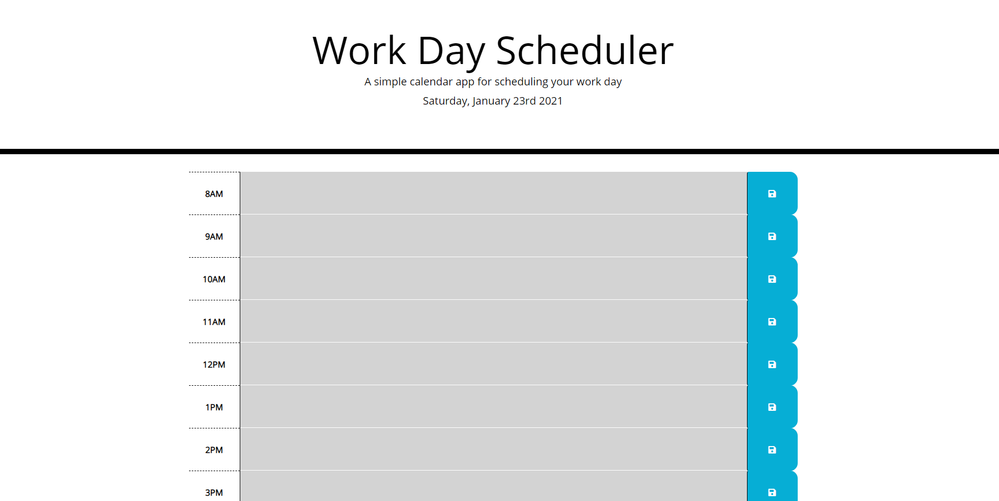
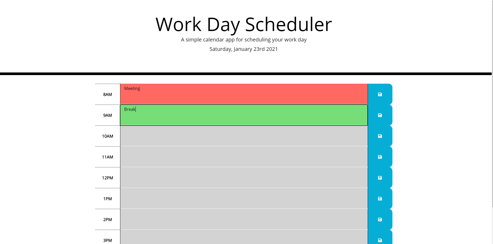

# Work-Day-Scheduler
- Built for saving Schedule
- Used HTML, CSS and JavaScript

# Usage
 1. User inputs text into box
 2. User saves the event
 3. Site shows current time and and future time in different colors

 